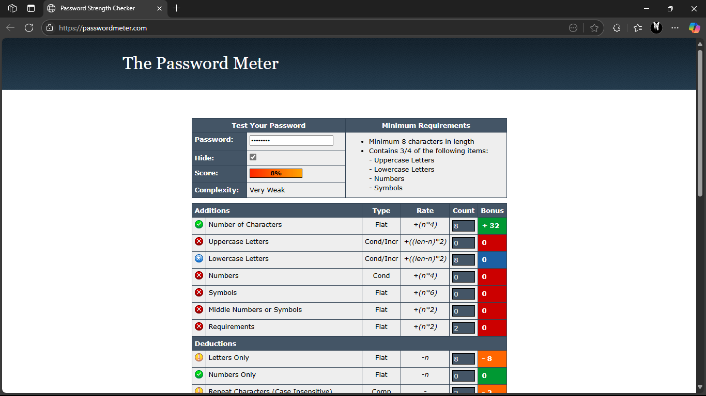
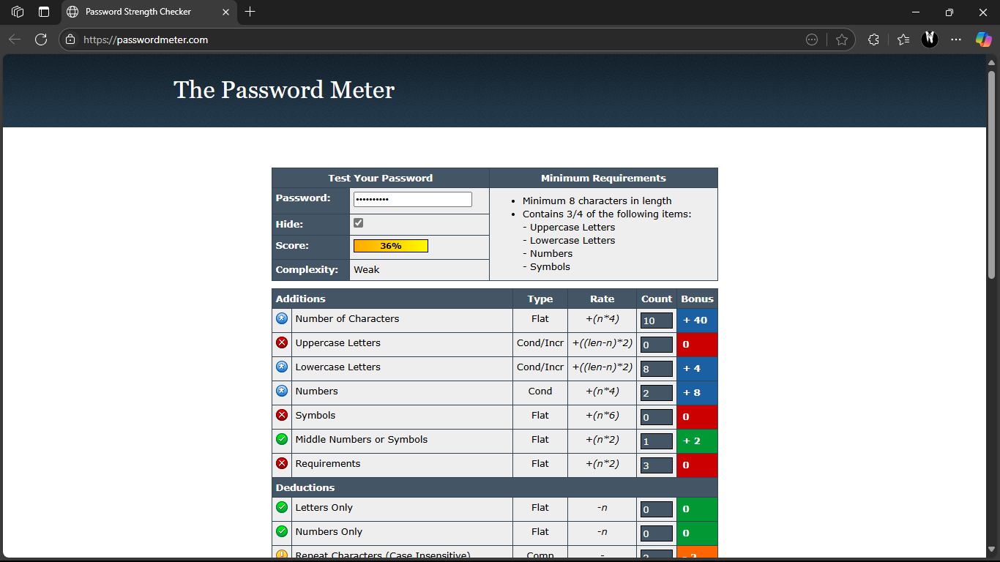
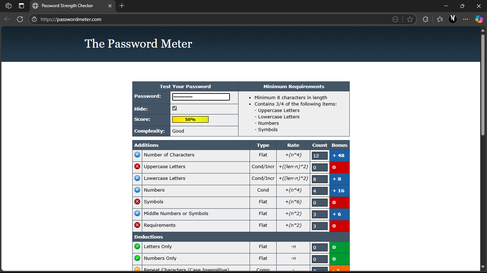
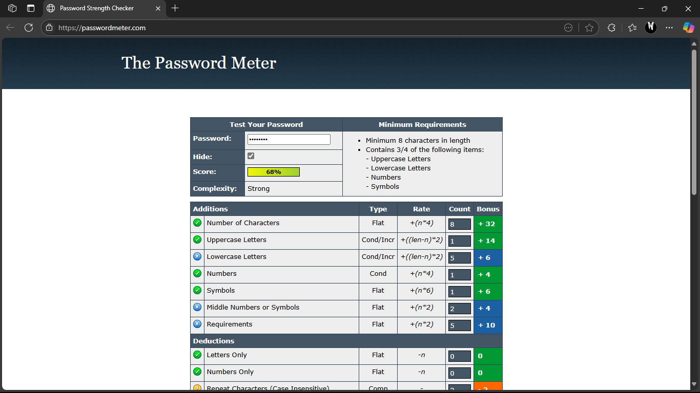
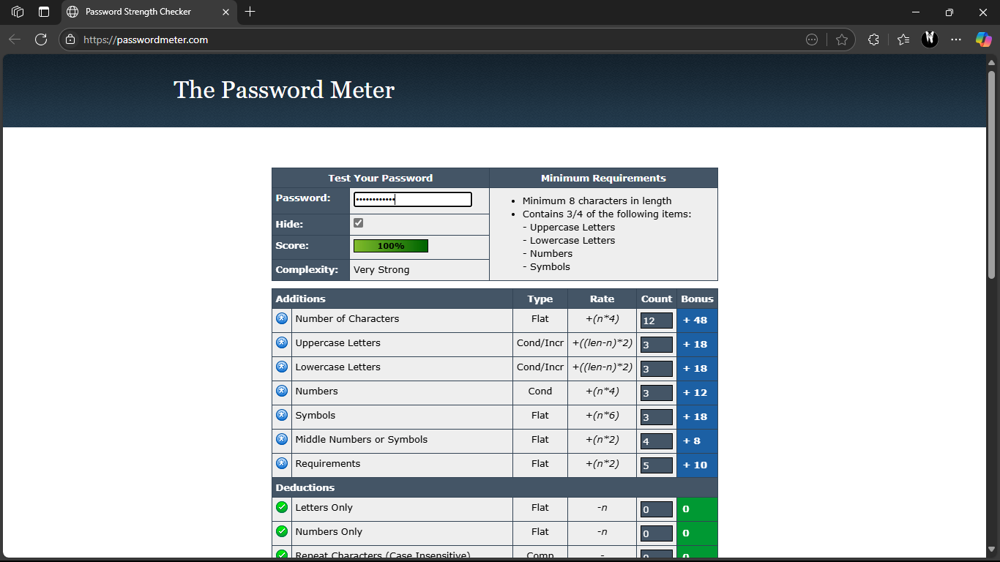

# Day 6 - Password Strength Evaluation

## 🔐 Objective:
Understand how to create strong passwords and evaluate them using online strength checkers.

---

## 🧪 Passwords Tested & Results

| Password | Strength Checker | Score | Feedback |
|---------|------------------|-------|----------|
| password123 | PasswordMeter | Very Weak | Too common, lacks complexity |
| P@ssw0rd! | PasswordMeter | Weak | Slightly predictable, better than average |
| 9u#M4z!GkQ2& | PasswordMeter | Good | Excellent use of all character types |
| MyDog$Eats!Pizza2025 | PasswordMeter | Strong | Long, memorable, complex |
| V4r!@bl3_P@$$phr@s3_89#A | PasswordMeter | Very Strong | Hard to crack, high entropy |

---

## 🖼 Password Strength Test Results

Here are the screenshots from testing the passwords:

### 🔹 password123

### 🔹 P@ssw0rd!

### 🔹 9u#M4z!GkQ2&

### 🔹 MyDog$Eats!Pizza2025

### 🔹 V4r!@bl3_P@$$phr@s3_89#A

---

## 🛡 Concepts & Best Practices

### 🔸 What Makes a Password Strong?
- Use at least 12 characters
- Include uppercase, lowercase, numbers, and symbols
- Avoid personal info like names or birthdates
- Do not use dictionary words or common patterns

### 🔸 Common Password Attacks
- **Brute Force Attack**: Attempts every possible combination
- **Dictionary Attack**: Uses precompiled lists of common words and passwords

### 🔸 Why Password Length Matters
- The longer the password, the harder it is to crack
- 16+ characters is highly recommended

### 🔸 What is a Passphrase?
- A series of unrelated words like `Purple$Tiger!Rides7Moon`
- Easier to remember but highly secure

### 🔸 Multi-Factor Authentication (MFA)
- Adds a second verification layer (e.g., OTP, biometrics)
- Reduces impact of stolen passwords

### 🔸 Password Managers
- Securely store unique passwords
- Auto-fill and generate strong passwords

### 🔸 Common Mistakes in Password Creation
- Using predictable words or patterns
- Reusing the same password across multiple accounts
- Including personal info like pet names or birthdays

---

## ✅ Conclusion:
A strong password is your first line of defense. Use passphrases, enable MFA, and rely on password managers for better digital security.
